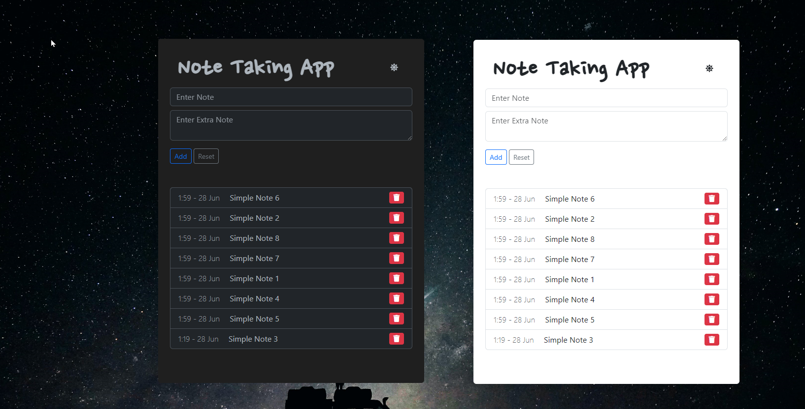

# Electron Notes App

This is a simple Electron application for taking and managing notes. It uses
Electron to create a desktop application with a web-based user interface. The
application uses NeDB, a lightweight JavaScript database, for storing note data.



## Features

- Add new notes with a title and additional details
- Edit existing notes
- Delete notes
- View the list of all notes
- Sort notes by date and time created

## Installation

1. Clone the repository

   ```bash
   git clone https://github.com/shpetimhaxhiu/simple-electron-notes-app.git
   ```

2. Install the dependencies
   ```bash
   cd electron-notes-app
   npm install
   ```

## Usage

To run the application, use the following command:

```bash
npm start
```

The application will open in a new Electron window. You can add, edit, and
delete notes using the user interface.

## Code Structure

- `main-clean.js`: This file contains the main Electron process code. It creates
  the application window, handles events, initializes the NeDB database, and
  communicates with the renderer process via IPC (Inter-Process Communication).

- `renderer-clean.js`: This file contains the renderer process code. It handles
  user interactions and displays the user interface. It communicates with the
  main process via IPC.

- `preload-clean.js`: This file is used as a preload script for the renderer
  process. It assigns the `ipcRenderer` module to the global
  `window.ipcRenderer` variable, allowing the renderer process to communicate
  with the main process.

- `index.html`: This file contains the HTML code for the user interface.

To read more about the code structure, see the [SPEC.md](SPEC.md) file.

## Dependencies

- Electron: Used for creating cross-platform desktop applications using web
  technologies.
- NeDB: A lightweight JavaScript database for storing data.
- Bootstrap: A popular CSS framework for building responsive and mobile-first
  websites.
- Font Awesome: A popular icon set library.

## License

This project is licensed under the [MIT](LICENSE) License.

## Acknowledgements

- [Electron](https://www.electronjs.org/)
- [NeDB](https://github.com/louischatriot/nedb)
- [Bootstrap](https://getbootstrap.com/)
- [Font Awesome](https://fontawesome.com/)

## Contributing

Contributions are welcome! If you find any issues or have suggestions for
improvements, please feel free to create an issue or submit a pull request.
